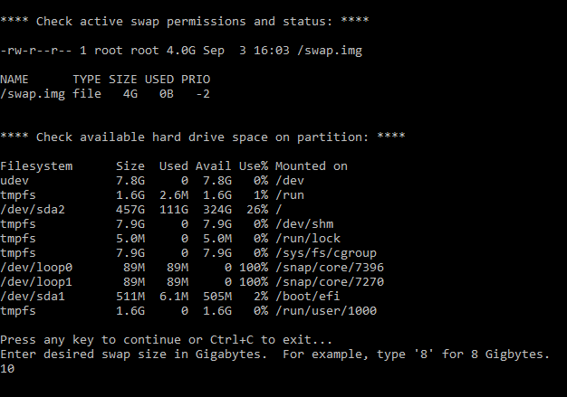

# linux_scripts
Tested on Ubuntu 18.04 LTS Bionic Beaver

### Swap Script: Temporarily increase swap file size on Ubuntu with enlarge_swap.sh

The default swap file size on Ubuntu Server 18.04 is only 4 Gigabytes.  In contrast, desktop Dell Ubuntu 16.04 allocates
over 30 GB.

#### <ins>Use Case:</ins>
Apps like LightGBM may need a larger swap to avoid program termination due to insufficient memory.  For example, fitting
the gradient boosting model with larger training data causes memory usage spikes.

### How to use:
***
Download the file from GitHub and make sure file permission is executable for the owner, typically the superuser "root".
Then run the script.

* **Permissions:** `sudo chmod 700 enlarge_swap.sh`
* **Run script from the script folder:** `sudo ./enlarge_swap.sh`

The script will show available partition space.  If partition space is sufficient for a larger swap file, press any key.
Otherwise, exit the script with "Ctrl-C".  Enter the desired swap size in Gigabytes.  For example, enter "8" for an
8 Gigabyte swap file and press enter.  The swap file will be resized.

<ins>**enlarge_swap.sh screenshot:**</ins>

The change is **temporary**.  Rebooting the system will revert swap size to the default.  The fstab file at /etc/fstab must be
updated to make the change permanent.
